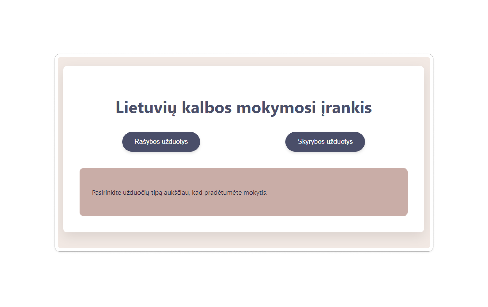
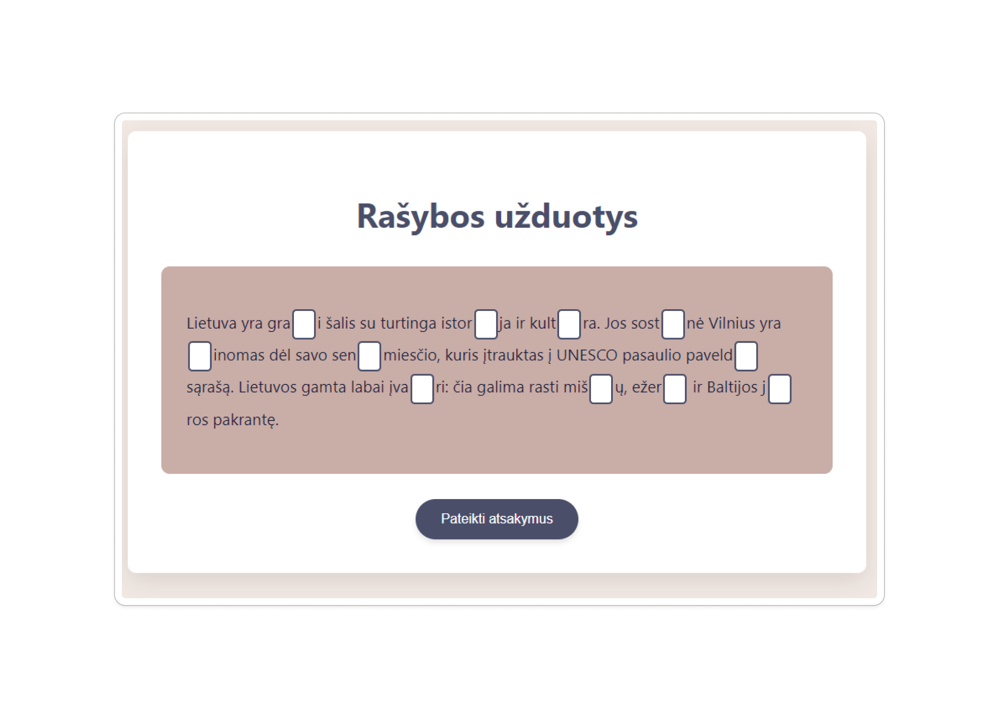
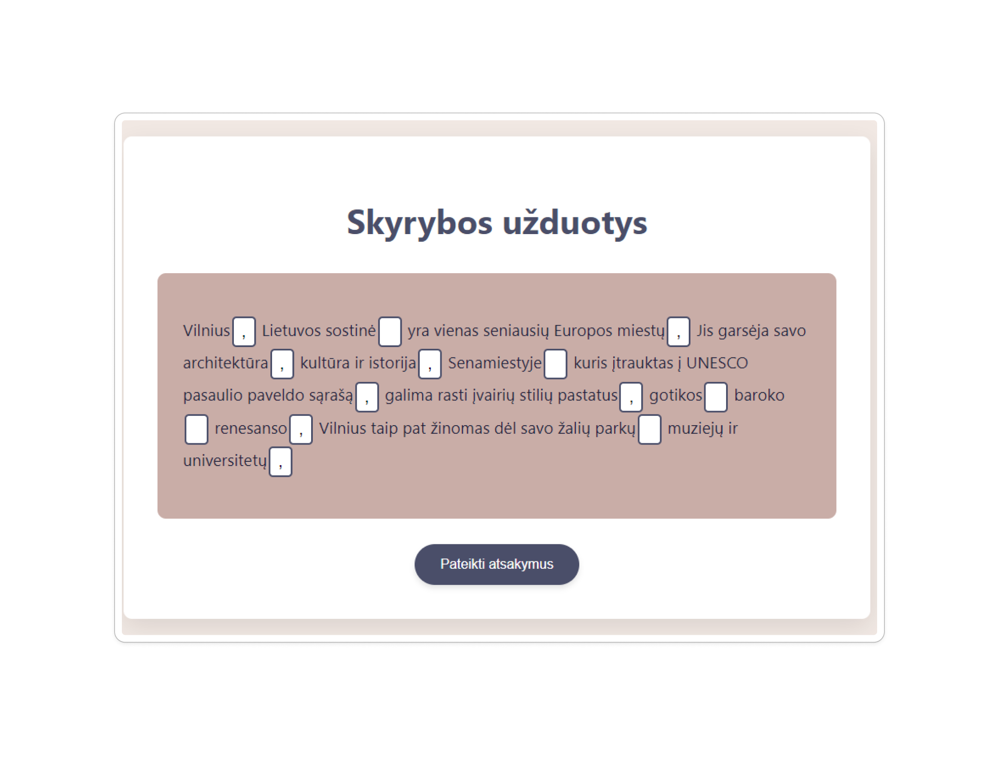

# Lithuanian Language Learning Tool

## Overview

The Lithuanian Language Learning Tool is designed to help users improve their grammar and punctuation in the Lithuanian language. This tool will provide various tasks, such as grammar exercises and punctuation correction, allowing users to work on their linguistic skills while tracking their progress. 

Users will be able to register, log in to the system, and access personalized statistics related to their performance on tasks. The tool's interface will be simple and intuitive, as shown in the images below, allowing seamless interaction for users at various levels of proficiency.

## Table of Contents

1. [Features](#features)
2. [Technologies](#technologies)
3. [User Flow](#user-flow)
4. [Screenshots](#screenshots)
5. [Installation](#installation)
6. [Usage](#usage)
7. [License](#license)

---

## Features

- **User Registration & Login**: Users can create accounts to save progress.
- **Grammar Exercises**: Provides users with Lithuanian grammar tasks.
- **Punctuation Exercises**: Allows users to practice placing correct punctuation in provided sentences.
- **Task-based Learning**: Tasks include grammar exercises, punctuation, and dictation.
- **Difficulty Levels**: Users can select from different difficulty levels (e.g., 5-8 class, 9-12 class).
- **Statistics and Performance Tracking**: Users can view their mistakes, scores, and improvement over time.

## Technologies

The core of this tool will be built using **C#** for backend functionality. Frontend technologies are not yet defined but will likely involve a combination of HTML/CSS and JavaScript to create an interactive user experience.

Backend:
- **C#**
- **ASP.NET (tentative)**

Frontend:
- **HTML/CSS/JavaScript**
- **Blazor**

Database:
- To be determined, but possibly SQL-based to store user data, performance metrics, and Lithuanian language books for reference.

## User Flow

The following diagram illustrates the user flow in the Lithuanian Language Learning Tool:


1. Users start by registering or logging into the system.
2. After logging in, they can select the type of task they want to complete, such as grammar exercises or punctuation correction.
3. Users choose a difficulty level, selecting appropriate Lithuanian textbooks based on their grade level (5-8 or 9-12).
4. The system generates tasks based on their selection, which the user completes by providing answers.
5. Once the task is completed, the system shows their score, mistakes, and correct answers. The information is stored in their account for future reference.

## Concepts

Here are some images showing different parts of the application:

### Intro Page
The main page where users can choose the type of tasks (Grammar or Punctuation):



### Grammar Task
Example of how a grammar task will appear for users:



### Punctuation Task
Example of a punctuation task, where users will need to place the correct punctuation marks:



## Installation

1. Clone the repository to your local machine:
    ```bash
    git clone https://github.com/GustasGrieze/lithuanian-language-learning-tool
    ```
2. Run the application locally:
    ```bash
    dotnet run
    ```


